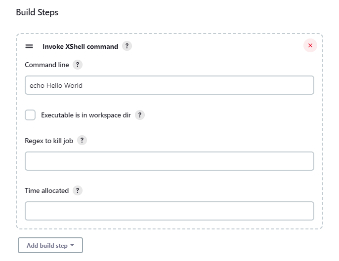

# Cross-platform shell

This plugin defines a new build type to execute a shell command in a
cross-platform environment.

## Description

Cross platform shell executor.

Using Jenkins built-in "Execute Windows batch command" you can run
commands using the windows shell.

Using Jenkins built-in "Execute shell" you can run commands using unix
shell.

If you need to run a job cross platform you cannot use the two standard
executors provided by Jenkins. You need a "build step" that can be
executed both in Windows and in Unix.

This plugin does exactly this: it takes a command, as the two standard
build steps do, and executes it calling the correct shell depending on
the operating system running on the current job executor.

## What it does...

-   It runs any executable (with complete command line) available in the
    system from current working dir (command must be in Path or in job's
    workspace directory or subdirectory).
-   Automatic conversion of file separator is done according to the
    executing operating system.
-   Variable style is converted according to the executing operating
    system. E.g. `$JOBPARAM1` is converted to `%JOBPARAM1%` in the
    command if the executing operating system is Windows.

Constraints:

-   the current working directory of the command execution is always the
    job's workspace root.
-   ./ must not be included in command line (use the configuration
    switch provided to specify that command is in current working dir or
    subdir).

Examples:

**Example 1: run executable + script with parameter**

Write your command in the \*nix style:

``` syntaxhighlighter-pre
php scripts/build.php $JOBPARAM1
```

If the command runs on a \*nix node, the command runs un-altered. If it
runs on a Windows node, it is changed to:

``` syntaxhighlighter-pre
php scripts\build.php %JOBPARAM1%
```

Note that the file separator and variable naming convention have
changed.

## ... and what it does not!

### Command translation problem

#### Description

It cannot translate any command! So you cannot write

``` syntaxhighlighter-pre
rm -rf bin
```

because on windows `rm` command is not available.

#### Solution

You can wrap your commands in two scripts, one for windows and one for
unix, each one calling the right command for the operating system:

**clean**

``` syntaxhighlighter-pre
rm -rf bin
```

**clean.bat**

``` syntaxhighlighter-pre
del /F /S bin
```

and then call `clean` using an XShell build step.
This will execute `clean` in unix and `clean.bat` in windows.

## Notes

-   in windows you can call clean and get clean.bat called, in unix you
    can't (so the solutions above work);
-   in unix you have to specify if the command is in the current working
    dir (and if it is not available it will not be searched in PATH), in
    windows you haven't to.

## Build step configuration

To add a XShell build step,

-   click on the `Add build step` button and choose
    `Invoke XShell script`;
-   fill in the command line text;
-   choose if the executable is in global Path or in workspace.



## Release Notes

* For recent versions, see [GitHub Releases](https://github.com/jenkinsci/xshell-plugin/releases)
* For versions 0.10 and older, see the [changelog archive](https://github.com/jenkinsci/xshell-plugin/blob/120.v1307d168def8/CHANGELOG.md)
